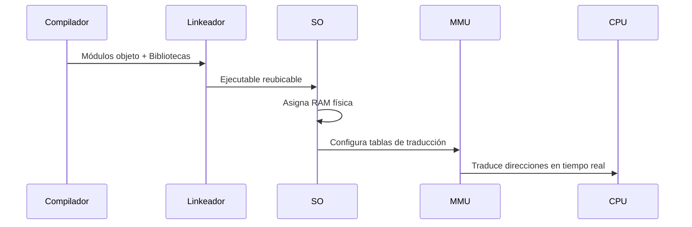

3/9/2025 - Horacio Pendenti: Teoría

Clase Anterior: [[Clase 7]]

Tema de hoy: 
## Administración de Memorias.

Entidades importantes;
Procesos y planificación de procesos.
La memoria, como tema de extrema importancia.

Primero que nada sin estar cargado en la memoria principal, no se puede ejecutar.
segundo, donde reciben los procesos. que se ejecutan están en la memoria principal.

los procesos, que sabemos como son, ahora sabemos donde van a estar alojados y como podemos hacer para que todo esto funcione.

1 de las cosas que debe hacer el SO, es agarrar el proceso, asignarle memoria, y asignarlo a la memoria principal. y hay una parte del sisOp que se encarga de esto.

Esto es lo que vamos a ver: 
## Carga y Linkeo.

el programa se le da forma, y se le agrega el PCB.
![[Pasted image 20250903182310.png]]

---


```markdown
# Administración de Memoria: Carga y Linkeo
> Basado en William Stallings, "Operating Systems: Internals and Design Principles" (Cap. 8)

---

## 🔑 Conceptos Fundamentales
### **Memoria Principal (RAM)**
- **Definición:** Array de bytes direccionable donde se almacenan procesos en ejecución
- **Características:**
  - Volátil (pierde datos al apagarse)
  - Acceso directo por CPU
  - Recurso crítico y limitado
- **Relevancia:** Sin carga en RAM → **ningún proceso puede ejecutarse** (Stallings, Cap. 8.1)

### **Proceso en Contexto de Memoria**
- **Componentes que requieren memoria:**
  - Código ejecutable (instrucciones)
  - Datos estáticos (variables globales)
  - Heap (memoria dinámica)
  - Pila (llamadas a funciones)
- **Representación:** Bloque de Control de Proceso (PCB) incluye:
  - Punteros a memoria asignada
  - Límites de protección
  - Información de paginación/segmentación

---

## 🔗 Linkeo (Enlazado)
### **Definición**
Proceso de combinar módulos objeto y bibliotecas para crear un ejecutable completo (Stallings, Sección 8.2)

### **Tipos de Linkeo**
| Tipo | Momento | Ventajas | Desventajas |
|------|---------|----------|-------------|
| **Tiempo de compilación** | Durante compilación | Ejecutable autónomo | No permite compartir bibliotecas |
| **Tiempo de carga** | Al cargar en RAM | Permite bibliotecas compartidas | Requiere recarga si cambia biblioteca |
| **Tiempo de ejecución** | Durante ejecución | Flexibilidad máxima (plugins) | Sobrecarga en tiempo real |

### **Ejemplo Práctico**
```bash
# Linkeo estático con biblioteca matemática
gcc -o programa main.c -lm
```
- `main.c` + `libm` → ejecutable autónomo
- Direcciones de `sqrt()` resueltas en compilación

---

## 📤 Carga (Loading)
### **Definición**
Proceso de transferir un ejecutable desde disco a RAM y prepararlo para ejecución (Stallings, Sección 8.3)

### **Responsabilidades del SO**
1. **Asignar bloque físico de memoria**
2. **Reubicar direcciones lógicas → físicas**
3. **Configurar PCB con información de memoria**
4. **Establecer mecanismos de protección**

### **Tipos de Carga**
| Tipo | Mecanismo | Casos de Uso |
|------|------------|--------------|
| **Carga absoluta** | Direcciones físicas fijas | Sistemas embebidos simples |
| **Carga reubicable** | Ajuste dinámico de direcciones | Sistemas multiprogramados |
| **Carga dinámica** | Carga bajo demanda | Memoria virtual |

### **Proceso de Reubicación**


---

## 🔄 Integración SO-Hardware
### **Componentes Clave**
1. **Memory Management Unit (MMU)**
   - Hardware que traduce direcciones lógicas → físicas
   - Implementa protección de memoria
2. **Gestor de Memoria del SO**
   - Algoritmos de asignación (best-fit, first-fit)
   - Manejo de paginación/segmentación
   - Swapping (memoria virtual)

### **Flujo Completo: Linkeo → Carga → Ejecución**


---

## 💡 Importancia en Sistemas Modernos
### **Problemas Resueltos**
- **Multiprogramación:** Permite múltiples procesos en RAM simultáneamente
- **Protección:** Aísla espacios de memoria entre procesos
- **Eficiencia:** Optimiza uso de RAM limitada

### **Consecuencias de Mala Gestión**
- **Fragmentación:** Huecos inutilizables en memoria
- **Thrashing:** Excesivo swapping disco-RAM
- **Violaciones de memoria:** Acceso no autorizado (segmentation fault)

### **Conexión con Memoria Virtual**
- **Paginación:** Divide memoria en páginas fijas (Stallings, Cap. 8.3)
- **Demanda Paging:** Carga páginas solo cuando se necesitan
- **Swap:** Mueve páginas inactivas a disco

---

## 📚 Referencias (Stallings)
- **Capítulo 8:** Memory Management
  - Sección 8.2: Linking
  - Sección 8.3: Loading
  - Sección 8.4: Swapping
- **Figuras Clave:**
  - Figura 8.1: Direcciones lógicas vs físicas
  - Figura 8.3: Proceso de reubicación
  - Figura 8.7: Estructura de paginación

---

## 📝 Notas para Obsidian
### **Tags**
#SistemasOperativos #Memoria #Stallings #GestionDeMemoria #LicenciaturaEnSistemas

### **Relaciones**
- [[Procesos]] - Unidades que requieren memoria
- [[Planificación de CPU]] - Depende de procesos cargados en RAM
- [[Memoria Virtual]] - Extensión de este tema
- [[Fragmentación]] - Problema derivado de mala gestión

### **Preguntas Clave**
1. ¿Cómo afecta el tipo de linkeo al rendimiento del sistema?
2. ¿Por qué la reubicación es esencial en sistemas multiprogramados?
3. ¿Qué rol juega la MMU en la protección de memoria?
4. ¿Cómo se relaciona la carga con la planificación de procesos?
```

---

### 🖼️ Diagrama Separado (Para guardar como "ContenidoFoto")

**Descripción para crear la imagen:**

```mermaid
graph TD
    A[Código Fuente<br>(main.c)] -->|Compilación| B[Módulos Objeto<br>(main.o)]
    B -->|Enlazado| C[Ejecutable Reubicable<br>(programa)]
    C -->|Almacenamiento| D[Disco]
    D -->|Carga| E[Asignación RAM<br>(SO)]
    E -->|Reubicación| F[Direcciones Físicas<br>(MMU)]
    F -->|Ejecución| G[CPU]
    
    H[Bibliotecas<br>(libc)] --> B
    
    style A fill:#f9f,stroke:#333
    style C fill:#bbf,stroke:#333
    style E fill:#f96,stroke:#333
    style G fill:#6f9,stroke:#333
```

**Instrucciones para guardar:**
1. Copia el código Mermaid anterior
2. Pégalo en un editor de diagramas online (como [Mermaid Live Editor](https://mermaid.live))
3. Exporta como PNG/SVG
4. Guarda con nombre: `ContenidoFoto_CargaLinkeo.png`

**Elementos clave del diagrama:**
- **Flujo principal:** Código fuente → Compilación → Linkeo → Ejecutable → Carga en RAM → Ejecución
- **Componentes destacados:**
  - Bibliotecas (entrada al linkeador)
  - SO (gestor de carga)
  - MMU (traducción de direcciones)
  - CPU (ejecución final)
- **Colores diferenciados:**
  - Morado: Código fuente
  - Azul: Ejecutable
  - Naranja: Asignación RAM
  - Verde: Ejecución en CPU
---

## Linker
* Su función es tomar un conjunto de módulos objeto y producir un módulo listo para cargar.

![[Pasted image 20250903182934.png]]

![[Pasted image 20250903190348.png]]

Empaquetar todos mis módulos, y lo arma en un solo modulo ejecutable, que arranca en una referencia 0 de ese programa, y sigue hasta el final del código.


---


Memorias lógicas y memorias digitales

Direcciones Físicas: las físicas de la ram.


## Carga Absoluta.
* El cargador absoluto requiere que un programa sea cargado siempre en la misma ubicación en memoria.
* Las referencias a posiciones de memoria se realizan en el momento de la compilación.

Desventajas:
* El programa debe ser cargado siempre en la misma ubicación en memoria.
* El programador debe saber de antemano cuál es la estrategia de asignación de memoria del SO.
* Las modificaciones al programa cambian las direcciones y se deben corregir (por el programador).

## Carga Reubicable
* Necesitamos cargar un programa en cualquier lugar de la memoria, especialmente en multiprogramación.
Para esto:
* El ensamblador o compilador produce direcciones relativas al comienzo del programa.
* Si el programa se carga a partir de la posición de memoria física x, el cargador simplemente suma x a cada referencia de memoria del programa a medida que lo carga.

## Carga Dinámica, en run-time
* La carga reubicable no permite una multiprogramación eficaz: pensemos en swap-in swap-out.
* La idea ahora es demorar el cálculo de la dirección absoluta hasta que sea necesaria en el momento de ejecución.
* Para no afectar la performance, la traducción debe ser realizada por hardware.

la ejecución de una instrucción puede llevar a tener 3 parámetros, 3 referencias, 3 datos distintos, en diferentes lados del programa, hay que ir 3 veces a la memoria principal para buscar cosas.
Es muy caro.


![[Pasted image 20250903184735.png]]

---
**Sinónimos:** absoluta, real, física. 

A toda dirección relativa/Lógica, que van del 0 al... 2000? siempre se les suma la dirección de memoria, a toda referencia que se produzca le sumo 100, y así.

Traducción de Direcciones de memoria a Física:

mi programa son direcciones lógicas de 0 a x. cuando ese programa se esta ejecutando el procesador, tengo un jump 400, lo que se ejecuta. quiere ir al 400 físico, pero yo se que al usar una carga reubicable, hay que hacer una traducción, esa referencia lógica 400 que se genero inicialmente, cuando ejecute la instrucción, la tengo que traducir para buscarla en la memoria física real, la traduzco sumando X, y llego a una dirección de memoria física.

el procesador va a la memoria real, principal únicamente, entonces tenés que saber la diferencia, el programa tiene de 0 a X por eso hay que traducirla.

solo en CARGA ABSOLUTA no hace falta esto. pero todos los demás requiere un esquema de traducciones de memoria de lógica a física.

---


![[Pasted image 20250903190547.png]]

---

## Administración de Memoria
*La administración de la memoria es la tarea del manejo dinámico de la subdivisión del espacio de usuario  asignado a los distintos programas de usuario en la memoria principal.*

**Algunas Definiciones previas:**
* **Frame o marco de página**: Un bloque contiguo de memoria principal de longitud fija.
* **Página:** Cada una de las porciones de longitud fija en las que se divide un proceso, del mismo tamaño que un frame.
* **Segmento:** Una porción del espacio lógico de direcciones de longitud variable. Cada una de las partes en que se divide un programa, especificada por el programador. 
  Un segmento completo puede ser copiado temporalmente en una región disponible de memoria principal (segmentación) o el segmento puede ser dividido en páginas, que pueden ser copiadas individualmente a memoria principal (segmentación combinada con paginación).

**Que es un Frame?** Pedacito de la memoria Principal de longitud fija. divido mi proceso, la imagen de mi proceso en paginas. 

> **MANO**: *Memoria Asignada No Ocupada.*

> **Espacio Lógico de Direcciones, es VIRTUAL.** 

## Requerimientos para la Administración de la Memoria

**Reubicación (Relocation):**
 * El swap-out y swap-in difícilmente logren ubicar un proceso exactamente en la misma ubicación en memoria principal.
 
**Protección (protection):**
* El hardware debe contar con mecanismos que no permitan a un proceso escribir en zonas de memoria no-propias o no permitidas.

**Compartición (sharing):**
* Los procesos deben compartir áreas de datos e incluso programas.

**Organización lógica (logical organization):**
* Deseable una organización por módulos: segmentación.

**Organización física (phisical organization):**
* El movimiento de información entre los dos niveles de memoria es una responsabilidad del sistema, no del programador. Tarea esencial de la administración de memoria.
(Swap-Out <-> Swap-In)

---

## Asignación de Memoria
*Mecanismo por el cual el S.O. determina la ubicación en memoria de un programa ajustando convenientemente las estructuras de datos para tal fin.*

![[Pasted image 20250903192742.png]]

---

## Particionado de Memoria

Particiones: el caso mas simple es toda la memoria digital, partirla lógicamente del mismo tamaño. Es la forma mas simple que tenemos, que pasa si tengo que acomodar un programa así me va a desperdiciar mucha memoria. 

> **No se puede compartir entre nadie, entre procesos.**

No se puede asignar 2 particiones a una pagina de 9 megas si la partición es de 8 megas.

las estáticas, al cargarse no se puede editar las particiones, se crean y ya.

**Fragmentación Externa:** A partición completas, que no las puedo asignar un programa, porque no entran. Están no asignadas, mientras tengo necesidad de cargas.

---
**DATO CURIOSO: VER**

Practica que tiene que ver con: que hace un compilador con un arreglo, como lo dispone en memoria principal al arreglo, si lo dispone contiguo o no? por fila, columnas?
En la parte de datos, puede resultar en graves problemas de eficiencia o no.

como, el compilador lo dispone en la memoria principal, te puede traer problemas de eficiencia o no.

